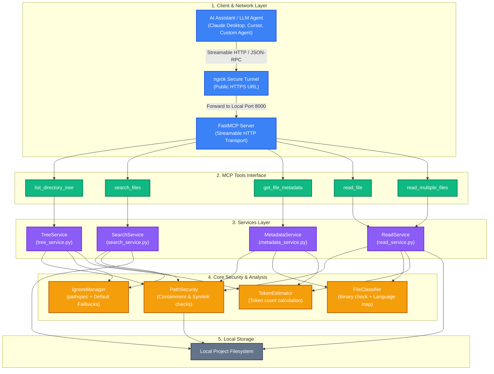
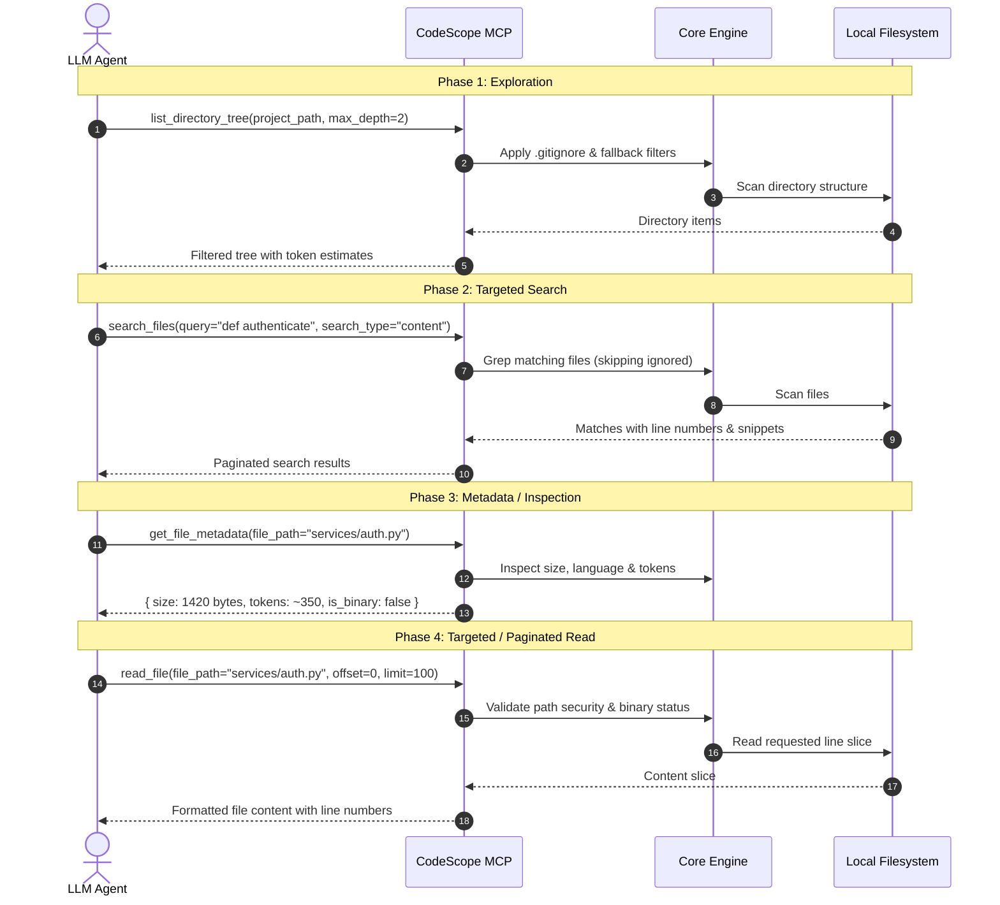

# 🔭 CodeScope MCP

> **Intelligent, Token-Optimized Codebase Context MCP Server for AI Agents & LLMs.**

CodeScope MCP provides LLMs and AI assistants with controlled, intelligent, and context-efficient access to local codebases over the **Model Context Protocol (MCP)** using **Streamable HTTP transport**.

Instead of naively dumping entire folders or overwhelming context windows with garbage files (`node_modules`, `.venv`, binaries, lock files), CodeScope acts as a security and context firewall, offering a layered toolset for codebase exploration, code search, and file retrieval.

---

## 📑 Table of Contents

- [What This Is About](#-what-this-is-about)
- [Why You Should Use It](#-why-you-should-use-it)
- [What It Does (Core Tools)](#-what-it-does-core-tools)
- [Architecture Overview](#-architecture-overview)
- [System Flow & Layered Discovery](#-system-flow--layered-discovery)
- [Project Structure](#-project-structure)
- [Getting Started](#-getting-started)
  - [Prerequisites](#prerequisites)
  - [Installation & Setup](#installation--setup)
  - [Environment Configuration](#environment-configuration)
  - [Running the Server](#running-the-server)
- [Working with Write Tools & AI Prompting](#-working-with-write-tools--ai-prompting)
- [Exposing with ngrok (Remote / Cloud Setup)](#-exposing-with-ngrok-remote--cloud-setup)
- [Connecting to MCP Clients](#-connecting-to-mcp-clients)
- [Security & Constraints](#-security--constraints)
- [Running Tests](#-running-tests)
- [License](#-license)


---

## 💡 What This Is About

When using AI coding assistants or LLM chat agents over MCP, granting raw filesystem access often leads to:
1. **Context Window Blowup**: Giant folders like `node_modules/`, `.git/`, `dist/`, or `.venv/` flooding prompt tokens.
2. **High Token Costs & Slow Responses**: Reading multi-megabyte files or large lock files (`package-lock.json`, `poetry.lock`).
3. **Binary Corruption**: Unintended dumping of binary or compiled files (`.pyc`, images, `.exe`, `.so`) into text prompts.
4. **Security Vulnerabilities**: Path traversal attacks (e.g. `../../../../etc/passwd` or accessing sensitive files outside project roots).

**CodeScope MCP** bridges this gap. It provides a standardized MCP server built on **FastMCP** with **Streamable HTTP** that delivers smart, token-efficient, `.gitignore`-aware file reading, fast code/regex search, and metadata analysis.

---

## 🚀 Why You Should Use It

| Feature / Problem | Raw Filesystem Tools | CodeScope MCP |
| :--- | :--- | :--- |
| **Context Consumption** | Dumps thousands of irrelevant files | `.gitignore` aware + built-in fallback ignore lists |
| **File Reading Strategy** | Reads whole files blindly | Line-by-line pagination (`offset`/`limit`) & batch reads |
| **Search Capabilities** | Slow or nonexistent grep | High-speed content & filename search with pagination |
| **Binary File Protection** | Crashes or spits corrupted ASCII | Automatic binary detection & safe refusal |
| **Security Containment** | Risks root escaping | Strict path resolution & traversal protection |
| **Token Estimation** | None | Real-time token estimates before reading |
| **Modern Transport** | Stdio or legacy SSE | **Streamable HTTP** (FastMCP 2.x standard) |

---

## 🛠️ What It Does (Core Tools)

CodeScope provides a progressive, token-conscious toolset for codebase exploration, code search, and safe write operations:

### 📖 Read Tools (Always Available)

#### 1. `list_directory_tree`
Generates a hierarchical directory tree starting from the project root.
- **Ignore Filtering**: Filters out `.git`, `node_modules`, `.venv`, `.next`, cache files, and custom `.gitignore` patterns.
- **Controls**: Supports `max_depth` limits and toggling hidden files (`include_hidden`).
- **Token Hints**: Supplies file sizes and token estimates per file directly inside the tree nodes.

#### 2. `search_files`
Performs fast search across file contents or filenames.
- **Search Modes**: `content` (grep search within file contents) or `filename` (find files by name).
- **Filters & Regex**: Supports regular expressions (`regex=True` with timeout guard), glob file patterns (e.g. `*.py`, `*.ts`), and case sensitivity.
- **Pagination**: Includes `offset` and `max_results` (with `has_more` flag) to prevent prompt overflows.

#### 3. `get_file_metadata`
Inspects file properties without consuming context on the file body.
- Returns file size in bytes, ISO 8601 last modified timestamp, detected programming language/format, binary status, and rough token estimate.

#### 4. `read_file`
Safely reads text file contents with built-in safeguards.
- **Pagination**: Supports 0-indexed line `offset` and `limit` to read chunks of large files.
- **Content Hash**: Returns `content_hash` (SHA-256) of the entire file, usable as `expected_hash` in subsequent write/edit calls to prevent clobbering concurrent edits.
- **Safety**: Automatically rejects binary files and enforces maximum file size and line caps.

#### 5. `read_multiple_files`
Batch file retrieval utility to fetch multiple files in a single MCP tool call.
- Reduces network round-trips and conversational turns when pulling code references found via search.

---

### ✍️ Write & Edit Tools (Opt-in via `ENABLE_WRITE_TOOLS=true`)

Write tools are disabled by default. When enabled, they operate under strict allowlist containment, atomic write safety, style preservation, and staleness verification:

#### 6. `write_file`
Creates a new file or completely overwrites an existing file.
- **Safety**: Requires `overwrite=True` to replace an existing file.
- **Style Preservation**: Overwrites preserve the existing file's encoding, BOM, and line endings (CRLF/LF).
- **Staleness Check**: Supports `expected_hash` to verify file state before writing.
- **Dry Run**: Supports `dry_run=True` to preview unified diffs without modifying disk.

#### 7. `edit_file`
Applies sequential exact-match string replacements to an existing file.
- **Precise**: Matches exact strings (including indentation and line breaks).
- **Sequential**: Edits apply in order, each operating on the result of previous edits in memory before atomic disk write.
- **Safety**: Fails atomically if any `old_string` is not found or ambiguous (unless `replace_all=True`).

#### 8. `delete_file`
Permanently deletes a single file within the allowed project root.
- Rejects directories, protected files, and ignored paths.

#### 9. `move_file`
Moves or renames a single file.
- Does not overwrite existing destination files (supports Windows case-only renames).
- Supports `create_parents=True` to create destination directories on demand.

#### 10. `copy_file`
Copies a single file within the project.
- Atomic copy via temporary files; does not overwrite existing files.

#### 11. `replace_in_files`
Safely performs bulk search-and-replace across multiple files.
- **Workflow**: Preview first with `dry_run=True` (default), then execute with `dry_run=False` and `expected_replacements` set to the previewed count.
- **Regex & Captures**: Supports regex back-references (e.g. `\1`) or literal string replacement.
- **Protection**: Excludes binary files, protected paths, and mixed-line-ending files automatically.


---

## 🏗️ Architecture Overview

The following Mermaid diagram illustrates the internal components and request flow of CodeScope MCP:



---

## 🔄 System Flow & Layered Discovery

To optimize context usage, LLMs interact with CodeScope using a progressive **cheap $\rightarrow$ expensive** workflow:



---

## 📁 Project Structure

```
CodeScope MCP/
├── main.py                     # Server entrypoint (loads .env and starts FastMCP)
├── server.py                   # FastMCP instance & tool registrations
├── config.py                   # Configuration settings, defaults & ignore patterns
├── requirements.txt            # Python dependencies
├── .env.example                # Template for environment variables
│
├── core/                       # Core security, classification & parsing logic
│   ├── path_security.py        # Path resolution, root containment & symlink policy
│   ├── ignore_manager.py       # .gitignore parsing (pathspec) & fallback ignores
│   ├── file_classifier.py      # Binary vs text detection & language mapping
│   └── token_estimator.py      # Token & character count estimation helper
│
├── services/                   # Business logic for MCP operations
│   ├── tree_service.py         # Builds filtered directory hierarchy
│   ├── search_service.py       # Regex & string search (content & filename)
│   ├── read_service.py         # Single & batch file reading with pagination
│   └── metadata_service.py     # File statistics & token inspection
│
├── tools/                      # MCP Tool wrapper endpoints
│   ├── list_directory_tool.py  # list_directory_tree tool
│   ├── search_files_tool.py    # search_files tool
│   ├── file_metadata_tool.py   # get_file_metadata tool
│   ├── read_file_tool.py       # read_file tool
│   └── read_multiple_files_tool.py # read_multiple_files batch tool
│
├── models/                     # Pydantic data schemas & contracts
│   └── schemas.py              # Input / output request & response models
│
├── utils/                      # Utilities & logging
│   └── logger.py               # Configured standard logger
│
└── tests/                      # Pytest unit & integration test suite
    ├── test_path_security.py
    ├── test_ignore_manager.py
    ├── test_tree_service.py
    ├── test_search_service.py
    └── test_read_service.py
```

---

## ⚡ Getting Started

### Prerequisites

- **Python 3.10+** installed
- **Git** installed

### Installation & Setup

1. **Clone the repository:**
   ```bash
   git clone https://github.com/Manthan29-code/CodeScope-MCP.git
   cd "CodeScope MCP"
   ```

2. **Create and activate a virtual environment:**
   - **Windows (PowerShell):**
     ```powershell
     python -m venv venv
     .\venv\Scripts\Activate.ps1
     ```
   - **Linux / macOS:**
     ```bash
     python3 -m venv venv
     source venv/bin/activate
     ```

3. **Install dependencies:**
   ```bash
   pip install -r requirements.txt
   ```

### Environment Configuration

Create a `.env` file from the example template:

```bash
cp .env.example .env
```

Edit `.env` to configure your server and write permissions:

```dotenv
# Server Settings
HOST=127.0.0.1
PORT=8000
DEFAULT_PROJECT_PATH=.         # Fallback workspace root on server
MAX_FILE_SIZE_BYTES=10485760   # 10 MB limit
MAX_LINES_PER_READ=1000        # Max lines returned per read call
ALLOW_SYMLINKS=false           # Prevent symlink escapes

# Write Operations Settings (Opt-in)
ENABLE_WRITE_TOOLS=true
WRITE_ALLOWED_ROOTS=C:\MyProject   # Semicolon-separated allowlist of writable folders
MAX_WRITE_SIZE_BYTES=1000000       # 1 MB write limit per file
MAX_EDITS_PER_CALL=50
MAX_DIFF_CHARS=50000
BLOCK_WRITES_TO_IGNORED=true
MAX_FILES_PER_REPLACE=100
REGEX_TIMEOUT_SECONDS=2.0
MAX_REGEX_PATTERN_LENGTH=500
```

> [!IMPORTANT]
> **`WRITE_ALLOWED_ROOTS` Security Gate**:
> All write tools operate in a **fail-closed** mode. If `WRITE_ALLOWED_ROOTS` is empty or if `project_path` is not inside an allowlisted folder, all write operations are refused. Setting `WRITE_ALLOWED_ROOTS=C:\MyProject` allows writing to any workspace inside `C:\MyProject\` (e.g., `C:\MyProject\WorkPulse`).

---

### Running the Server

Start the local server:

```bash
python main.py
```

By default, the server runs on `http://127.0.0.1:8000` with the MCP endpoint accessible at:
```
http://127.0.0.1:8000/mcp
```

---

## ✍️ Working with Write Tools & AI Prompting

When prompting AI coding assistants (like Cursor, Claude Desktop, or custom agents) connected to CodeScope MCP to generate or modify code, follow these best practices:

### 1. Relative Paths vs. Project Roots
- **`project_path`**: The absolute root of your project (e.g. `C:\MyProject\WorkPulse`).
- **`file_path`**: The clean relative path from `project_path` (e.g. `index.html`, `css/variables.css`, `js/modules/app.js`).
- ❌ Do **not** repeat the project name in the file path (e.g. avoid `WorkPulse/index.html` when `project_path` is already `C:\MyProject\WorkPulse`).

### 2. Automatic Nested Folder Creation (`create_parents=True`)
When writing into nested directories (such as `css/`, `js/modules/`, `assets/icons/`), CodeScope will automatically create all missing parent directories when `create_parents=True` is used.

### 3. File Updates & Rewrites (`overwrite=True`)
To replace an existing file completely, `overwrite=True` is required to prevent accidental overwrites. For partial modifications, AI models can use `edit_file` with exact-match string replacements.

---

### 💡 Example Prompt for AI Assistants (Building Modular Websites)

You can give your AI assistant a prompt like this to build projects end-to-end:

```markdown
Build a complete, modular web application for WorkPulse in `C:\MyProject\WorkPulse` using CodeScope write tools:

- Use `project_path="C:\\MyProject\\WorkPulse"`.
- Create a modular folder structure:
  ├── index.html
  ├── css/
  │   ├── variables.css
  │   ├── base.css
  │   └── components.css
  ├── js/
  │   ├── app.js
  │   └── modules/
  │       ├── state.js
  │       └── utils.js
  └── README.md
- Use `write_file` with `create_parents=True` for each file.
```

---

## 🌐 Exposing with ngrok (Remote / Cloud Setup)

If you are running CodeScope MCP locally and want to connect it to an external AI platform, cloud chat tool, or remote LLM service, you can expose the local Streamable HTTP server securely using **ngrok**.

### Step 1: Install ngrok

Choose the installation method for your operating system:

- **Windows (Winget / Chocolatey):**
  ```powershell
  winget install ngrok.ngrok
  # or
  choco install ngrok
  ```
- **macOS (Homebrew):**
  ```bash
  brew install ngrok/ngrok/ngrok
  ```
- **Linux (Snap / apt):**
  ```bash
  snap install ngrok
  ```
- **Direct Download:** Download the standalone binary from [ngrok.com/download](https://ngrok.com/download).

### Step 2: Authenticate ngrok

1. Sign up for a free account at [dashboard.ngrok.com](https://dashboard.ngrok.com).
2. Copy your authtoken and configure it in your terminal:
   ```bash
   ngrok config add-authtoken <YOUR_NGROK_AUTHTOKEN>
   ```

### Step 3: Start CodeScope MCP Server

Make sure your CodeScope MCP server is running in a terminal:
```bash
python main.py
```
*(Server listens locally on `http://127.0.0.1:8000`)*

### Step 4: Launch ngrok Tunnel

In a separate terminal, start an HTTP tunnel forwarding port `8000`:
```bash
ngrok http 8000
```

ngrok will display a forwarding URL in the dashboard:
```text
Session Status                online
Account                       Your Name (Plan: Free)
Forwarding                    https://a1b2-c3d4.ngrok-free.app -> http://localhost:8000
```

### Step 5: Copy Your Public MCP Endpoint

Your public MCP URL is the forwarding address with the `/mcp` route appended:
```
https://<your-ngrok-subdomain>.ngrok-free.app/mcp
```
*(For example: `https://a1b2-c3d4.ngrok-free.app/mcp`)*

> [!WARNING]
> Always append `/mcp` to your URL in the MCP client settings (e.g. `https://xxxx.ngrok-free.app/mcp`). Accessing the root path `/` will return `404 Not Found`.

---

## 🔌 Connecting to MCP Clients

Add CodeScope to your MCP client configuration (such as Cursor, Claude Desktop, LibreChat, or custom MCP agents):

#### Local Setup (Streamable HTTP):
```json
{
  "mcpServers": {
    "codescope": {
      "url": "http://127.0.0.1:8000/mcp",
      "transport": "streamable-http"
    }
  }
}
```

#### Remote Setup (via ngrok):
```json
{
  "mcpServers": {
    "codescope": {
      "url": "https://a1b2-c3d4.ngrok-free.app/mcp",
      "transport": "streamable-http"
    }
  }
}
```

---

## 🔒 Security & Constraints

- **Fail-Closed Write Allowlist**: Writes are strictly bounded by `WRITE_ALLOWED_ROOTS`. Attempts to access unauthorized paths or root drives are refused.
- **Protected Path Shield**: Protects `.git/`, `.env`, private keys (`*.pem`, `*.key`, `id_rsa*`) from being read, written, or modified.
- **Strict Path Containment**: Resolves all relative paths against the provided `project_path`. Attempts to escape the directory via `../` or absolute path jumps raise security exceptions.
- **Symlink Refusal**: Rejects symlinks by default (`ALLOW_SYMLINKS=false`) to prevent filesystem traversal via aliased paths.
- **Binary Content Guard**: Detects binary content to avoid corrupting text files or dumping raw bytes into prompts.
- **Style Preservation & Atomic Writes**: Preserves original line endings (CRLF/LF), BOM, and encodings, writing updates via temporary files to avoid partial file corruption.

---

## 🧪 Running Tests

CodeScope includes a full pytest test suite covering path security, ignore managers, tree building, search, reading services, and write/edit/file operations:

```bash
python -m pytest -q
```

---

## 📄 License

This project is licensed under the [MIT License](LICENSE).

